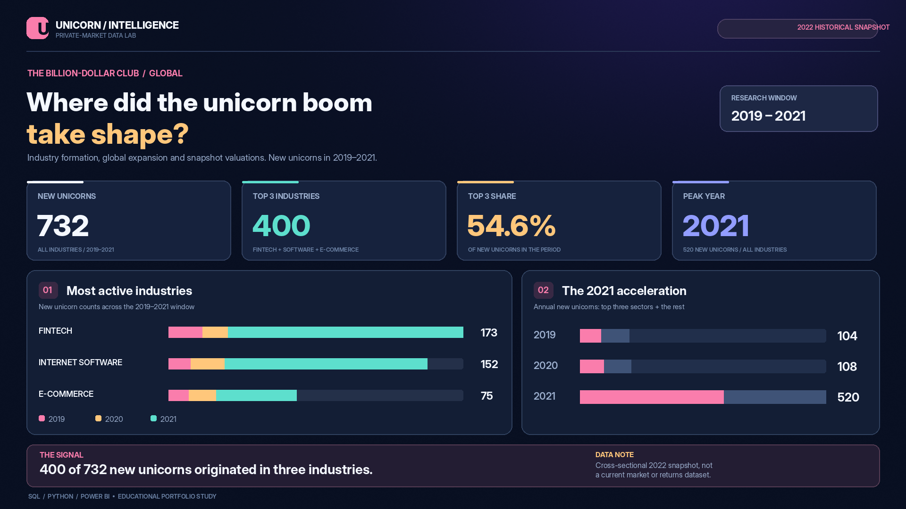
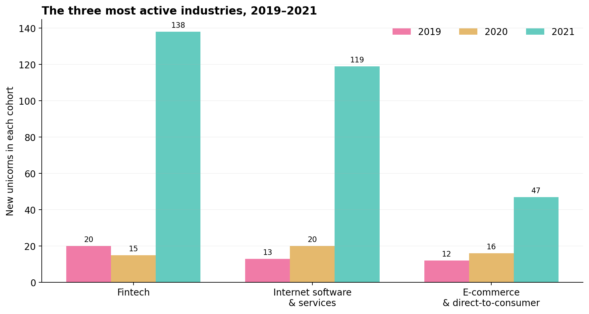
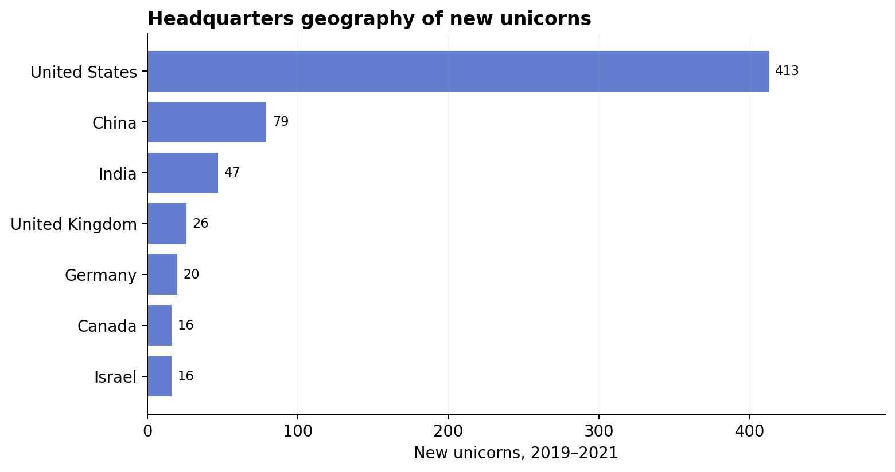

# The Billion-Dollar Club
### I looked at where the 2019–2021 unicorn boom actually came from.



*The graphic is a data-driven design preview, not a screenshot from Power BI. The numbers come from the historical dataset described below.*

**SQL · Python · Power BI**  |  **1,074 companies in the source**  |  **2019–2021 is the analysis window**

[Explore the dashboard](report/interactive_dashboard.html) · [See the SQL](sql/01_datacamp_solution.sql) · [Open the notebook](notebooks/unicorn_market_intelligence.ipynb) · [Read the two-page brief](report/executive_brief.pdf) · [Power BI files](powerbi/OPEN_IN_DESKTOP.md)

## Why I looked at this

I started with a relatively straightforward question from a DataCamp SQL exercise: **which industries produced the most new unicorns from 2019 to 2021?** A unicorn here is a privately held company valued at $1 billion or more.

My first instinct was to sort industries by valuation. But that answers a different question. One unusually valuable company can push an industry's average up without telling me how many *new* companies reached unicorn status. I separated those ideas: count new unicorns to identify the busiest industries, then use the dataset's valuation column to describe the companies in each year's cohort.

I kept the 2019–2021 window from the exercise. It also happens to capture a striking change in this dataset: 104 companies entered the club in 2019, 108 in 2020, and **520 in 2021**. That jump made me curious about two follow-up questions. Was it spread across industries? And where were those companies headquartered?

## What I found

**732** companies in this historical sample became unicorns during 2019–2021. Three industries accounted for **400 of them (54.6%)**:

| Industry | New unicorns, 2019–2021 | 2019 | 2020 | 2021 |
|:--|--:|--:|--:|--:|
| Fintech | **173** | 20 | 15 | 138 |
| Internet software & services | **152** | 13 | 20 | 119 |
| E-commerce & direct-to-consumer | **75** | 12 | 16 | 47 |



The concentration became clearer when I split the counts by year. Fintech and internet software together accounted for 257 of the 520 new unicorns recorded in 2021. The increase wasn't simply the result of one industry appearing at the top of the overall list.

But **more unicorns does not necessarily mean higher valuations**. Here is the result of the original SQL exercise, including average valuation for each industry-year cohort:

| Industry | Joined | New unicorns | Average valuation ($B) |
|:--|--:|--:|--:|
| Fintech | 2021 | 138 | 2.75 |
| Internet software & services | 2021 | 119 | 2.15 |
| E-commerce & direct-to-consumer | 2021 | 47 | 2.47 |
| Internet software & services | 2020 | 20 | 4.35 |
| E-commerce & direct-to-consumer | 2020 | 16 | 4.00 |
| Fintech | 2020 | 15 | 4.33 |
| Fintech | 2019 | 20 | 6.80 |
| Internet software & services | 2019 | 13 | 4.23 |
| E-commerce & direct-to-consumer | 2019 | 12 | 2.58 |

That difference made me check what **valuation** actually means here. The source provides **one historical snapshot valuation per company**, not a time series or its value on the day it first became a unicorn. So the $6.80B average for the 2019 fintech cohort is a description of companies that *joined in 2019*, measured at the dataset's later snapshot. It is **not** evidence that fintech companies were worth more *when they joined* in 2019 than in 2021. I kept that distinction visible in the charts and SQL comments.

## Where was the activity concentrated?

After looking at industries, I joined in the company headquarters table. Among the 732 new unicorns during the period, **413 were headquartered in the United States**, followed by **79 in China** and **47 in India**.



This is *headquarters geography*, not where companies earned their revenue or where investors were based. The US count is large in this sample, but it does not tell us where investment returns were highest.

## How I approached it

I used four source tables linked by `company_id`: company details, industry, funding/valuation and the date each company reached unicorn status. I checked that the public CSV copy contains **1,074 unique company IDs in each table**, then joined them one-to-one instead of relying on a row count alone.

The original SQL question drove the structure of the analysis:

1. **Choose the time window first.** Filter on `date_joined` for 2019–2021.
2. **Rank industries on the combined three-year company count.** Ranking each year separately would give a different set of industries, making the nine-row comparison inconsistent.
3. **Calculate yearly counts and mean snapshot valuations** for those same three industries. Use the industry's *count* for the ranking, not its average valuation.
4. **Look beyond the exercise.** Break out the annual spike, count headquarters countries and check whether source-quality issues change the interpretation.

The original assignment is in [`sql/01_datacamp_solution.sql`](sql/01_datacamp_solution.sql). I added separate queries for [country concentration](sql/02_country_concentration.sql), [annual growth](sql/03_annual_growth.sql), [industry valuation](sql/04_valuation_by_industry.sql), [approximate time to unicorn](sql/05_time_to_unicorn.sql) and [data checks](sql/06_quality_checks.sql). I recreated the main calculations in [Python](scripts/analyze.py) and kept the [results](results/01_top3_industry_2019_2021.csv) in CSV form so readers can inspect the actual figures without running a database.

The [interactive HTML dashboard](report/interactive_dashboard.html) has a year selector. The editable [Power BI project](powerbi/OPEN_IN_DESKTOP.md) is included as an additional way to explore the data, but the artwork at the top of this README was created separately and is labeled accordingly.

## What I would be careful about

This is a historical, approximately-2022 dataset. It is **not current private-market data**, and the figures cannot be used to infer today's valuations or investment returns. I found **16 missing headquarters cities, 13 zero-reported funding values and one founding year later than its unicorn year**. I flagged those records rather than quietly manufacturing corrections.

I also avoided treating the original data mirror as interchangeable with every version of the dataset online: the public split-table copy contains at least one early-April-2022 joining date, whereas the related Maven dataset is described as a March 2022 snapshot. The [source and license note](data/SOURCE_AND_LICENSE.md) records that distinction. The raw third-party CSVs are deliberately **not** redistributed here; the download script retrieves the documented source when you reproduce the work.

If I had annual valuation histories, funding-round dates and outcomes for companies that *didn't* become unicorns, I'd investigate how that changes the picture. These tables are useful for describing **which companies reached unicorn status and when**, but they are not enough to evaluate an investment strategy.

## Run the analysis

```bash
python -m pip install -r requirements.txt
python scripts/download_source.py
python scripts/analyze.py
python scripts/plot_results.py
python scripts/build_dashboard.py
python -m unittest discover -s tests -v
```

Start with [`sql/00_schema.sql`](sql/00_schema.sql) and [`sql/POSTGRES_IMPORT.md`](sql/POSTGRES_IMPORT.md) if you want to reproduce the queries in PostgreSQL. The Jupyter notebook walks through the main figures. The `powerbi/` folder includes a `.pbip` project, measures and a Desktop setup guide. The PBIP definition was generated and structurally checked, but **I haven't verified its rendering on Windows Power BI Desktop**.

## Repository map

| Folder | What's inside |
|:--|:--|
| [`sql/`](sql/) | Original question, additional queries, schema and PostgreSQL import guide |
| [`scripts/`](scripts/) and [`notebooks/`](notebooks/) | Reproducible Python work and annotated notebook |
| [`results/`](results/) | Verified query outputs and summaries |
| [`charts/`](charts/) and [`report/`](report/) | Data visualizations, interactive dashboard and short executive brief |
| [`powerbi/`](powerbi/) | Editable Power BI project, theme, DAX and setup instructions |
| [`data/`](data/) and [`tests/`](tests/) | Source record, validation results and checks |

**Dataset and exercise credit:** The starting SQL question is from [DataCamp's Analyzing Unicorn Companies project](https://www.datacamp.com/projects/1531). I used the four-table public educational dataset hosted in [Shaikh Borhan Uddin's repository](https://github.com/ShaikhBorhanUddin/Unicorn_Company_Analysis/tree/main/Dataset); the [Maven Analytics dataset](https://mavenanalytics.io/data-playground/unicorn-companies) is related. My question framing, SQL/Python workflow, visualizations and limitations are documented here rather than copying that repository's larger set of analyses.